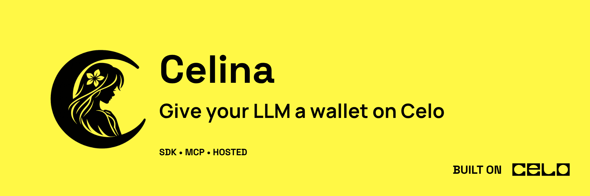
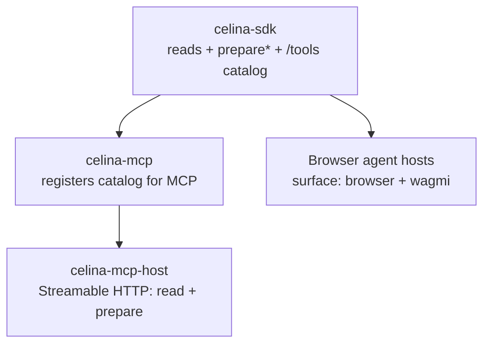

<p align="center">
  
</p>

# Celina SDK

**`@andrewkimjoseph/celina-sdk`** — Celo mainnet library for agent builders: **reads**, **unsigned transaction preparation**, and a shared **LLM tool catalog** (`/tools` export) that powers celina-mcp and browser wallet apps from one source of truth.

Pair with [wagmi](https://wagmi.sh) / viem when users sign in their wallet, or register the catalog in MCP / AI SDK hosts when building agents.

## Celina stack



| Layer | What it adds |
|-------|----------------|
| **SDK** (this package) | Chain logic, `SerializedPreparedFlow`, Carbon REST hybrid, CELINA calldata tag, and `@andrewkimjoseph/celina-sdk/tools` — shared Zod schemas and handlers for MCP and browser surfaces |
| **MCP** | Registers filtered catalog via `registerSdkTools`; stdio `execute_*` with `CELO_PRIVATE_KEY`; optional address defaults via [session wallet](guides/mcp-session-wallet.md) |
| **MCP host** | Public `https://mcp.usecelina.xyz/api/mcp` — **73 tools** (reads + GoodDollar reserve quote + Carbon prepare; `execute_carbon_*` omitted) |
| **Browser hosts** | `filterToolDefinitions(..., { surface: "browser" })` — user signs prepared txs in wallet; no server keys |

Third-party apps can consume the programmatic client only, or wire the full tool catalog into Vercel AI SDK / custom orchestrators — see [LLM tool catalog](guides/tool-catalog.md).

## What you can do

| Category | Examples |
|----------|----------|
| **Reads** | Token balances, Mento FX quotes, Uniswap v4 quotes, governance, ENS, GoodDollar whitelist/UBI, Carbon strategies/pairs/stats |
| **Estimates** | Gas for sends, FX swaps, Uniswap swaps, generic contract calls |
| **Prepare** | Unsigned flows for sends, Mento FX, Uniswap v4, Aave, GoodDollar UBI claim, Carbon strategies and taker trades |
| **Tool catalog** | `ALL_TOOL_DEFINITIONS`, `filterToolDefinitions` — same tools as celina-mcp, filterable by `surface`, `families`, and Carbon flags |

The SDK never holds or uses CELO wallet keys. Call `prepare*` with the user's address, then pass `steps` to wagmi.

Prepared calldata includes a **CELINA attribution suffix** on every tagged step — see [Prepared flows](concepts/prepared-flows.md).

## Quick start

```ts
import { createCelinaClient } from "@andrewkimjoseph/celina-sdk";

const celina = createCelinaClient({
  rpcUrl: "https://forno.celo.org",
  ethRpcUrl: "https://ethereum.publicnode.com", // optional, for ENS
});

await celina.token.getStablecoinBalances("0xYourAddress");
await celina.mentoFx.getFxQuote("USDm", "EURm", "100");

const flow = await celina.transaction.prepareSend("0xFrom", "0xTo", "USDm", "10");
// flow.steps → wagmi sendTransactionAsync
```

For agent hosts, import the shared catalog:

```ts
import { filterToolDefinitions, ALL_TOOL_DEFINITIONS } from "@andrewkimjoseph/celina-sdk/tools";

const tools = filterToolDefinitions(ALL_TOOL_DEFINITIONS, {
  surface: "browser",
  carbonPrepareEnabled: true,
  carbonExecuteEnabled: false,
});
```

See [Quick start](getting-started/quick-start.md), [LLM tool catalog](guides/tool-catalog.md), and [wagmi integration](guides/wagmi-integration.md).

## API overview

| Service | Reads | Prepare (unsigned) |
|---------|-------|---------------------|
| `blockchain` | network status, blocks, transactions | — |
| `account` | CELO balance, nonce | — |
| `token` | balances, token info, stablecoins | — |
| `ens` | resolve ENS names | — |
| `gooddollar` | whitelist status, UBI entitlement | `prepareClaimUbi` |
| `transaction` | gas fees, estimates | `prepareSend` |
| `mentoFx` | `getFxQuote`, `estimateFx` | `prepareFx` |
| `uniswap` | `getSwapQuote`, `estimateSwap` | `prepareSwap` |
| `aave` | — | `prepareSupply`, `prepareWithdraw` |
| `governance` | proposals list, details | — |
| `staking` | balances, validator groups | — |
| `nft` | NFT info, balance | — |
| `contract` | `callFunction`, `estimateGas` | — |
| `carbon` | strategies, pair explore, quotes, simulation, help | 13 `prepare*` methods — [Carbon guide](guides/carbon.md) |
| `self` | verify, lookup, session lifecycle | agent signing (Node + `selfAgentPrivateKey`) |

Full method signatures: [API reference](api-reference/README.md).

## Related packages

- [`@andrewkimjoseph/celina-mcp`](https://www.npmjs.com/package/@andrewkimjoseph/celina-mcp) — MCP server; registers SDK tool catalog
- [`celina-mcp-host`](../../celina-mcp-host/) — hosted reads + Carbon prepare (`https://mcp.usecelina.xyz/api/mcp`); no server-key writes
- [`@selfxyz/agent-sdk`](https://www.npmjs.com/package/@selfxyz/agent-sdk)
