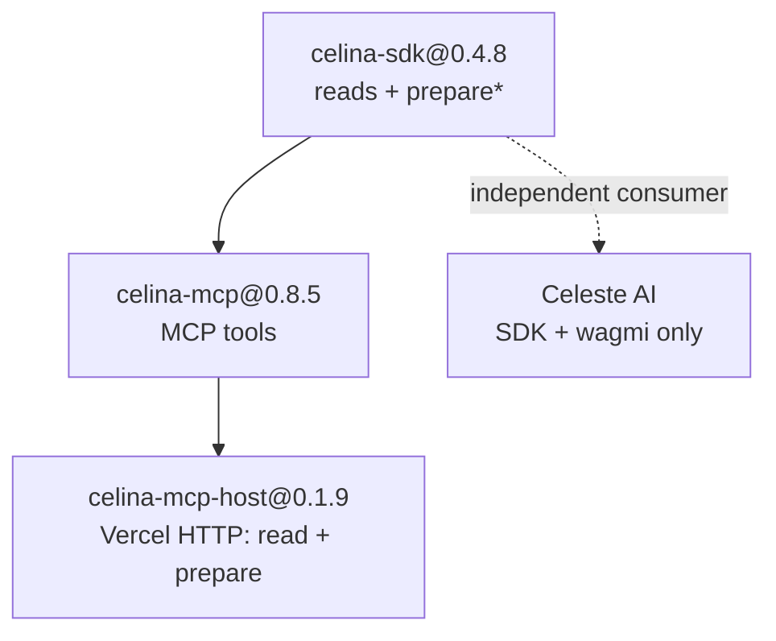

# Celina SDK

**`@andrewkimjoseph/celina-sdk@0.4.8`** — Celo mainnet library for frontend apps: **reads** and **unsigned transaction preparation** (no private keys).

Pair with [wagmi](https://wagmi.sh) / viem in the browser — users sign prepared transactions in their wallet.

## Celina stack



| Layer | What it adds |
|-------|----------------|
| **SDK** (this package) | Chain logic, `SerializedPreparedFlow`, Carbon REST hybrid, CELINA calldata tag. **Always pass explicit wallet addresses** from your app. |
| **MCP** | Tool names for LLM agents; stdio `execute_*` with `CELO_PRIVATE_KEY`; optional address defaults via [session wallet](guides/mcp-session-wallet.md). |
| **MCP host** | Public `https://mcp.usecelina.xyz/api/mcp` — **72 tools** (reads + Carbon prepare; no `execute_carbon_*`) |
| **Celeste AI** | Independent chat UI — uses **only** this SDK + connected wallet (not celina-mcp) |

Third-party apps can consume the SDK directly (e.g. custom Next.js UIs with wagmi) without MCP.

## What you can do

| Category | Examples |
|----------|----------|
| **Reads** | Token balances, Mento FX quotes, Uniswap v4 quotes, governance, ENS, GoodDollar whitelist/UBI, Carbon strategies/pairs/stats |
| **Estimates** | Gas for sends, FX swaps, Uniswap swaps, generic contract calls |
| **Prepare** | Unsigned flows for sends, Mento FX, Uniswap v4, Aave, GoodDollar UBI claim, Carbon strategies and taker trades |

The SDK never holds or uses CELO wallet keys. Call `prepare*` with the user's address, then pass `steps` to wagmi.

Prepared calldata includes a **CELINA attribution suffix** on every tagged step — see [Prepared flows](concepts/prepared-flows.md).

## Quick start

```ts
import { createCelinaClient } from "@andrewkimjoseph/celina-sdk";

const celina = createCelinaClient({
  rpcUrl: "https://forno.celo.org",
  ethRpcUrl: "https://ethereum.publicnode.com", // optional, for ENS
});

await celina.token.getStablecoinBalances("0xYourAddress");
await celina.mentoFx.getFxQuote("USDm", "EURm", "100");

const flow = await celina.transaction.prepareSend("0xFrom", "0xTo", "USDm", "10");
// flow.steps → wagmi sendTransaction
```

See [Quick start](getting-started/quick-start.md) and [wagmi integration](guides/wagmi-integration.md).

## API overview

| Service | Reads | Prepare (unsigned) |
|---------|-------|---------------------|
| `blockchain` | network status, blocks, transactions | — |
| `account` | CELO balance, nonce | — |
| `token` | balances, token info, stablecoins | — |
| `ens` | resolve ENS names | — |
| `gooddollar` | whitelist status, UBI entitlement | `prepareClaimUbi` |
| `transaction` | gas fees, estimates | `prepareSend` |
| `mentoFx` | `getFxQuote`, `estimateFx` | `prepareFx` |
| `uniswap` | `getSwapQuote`, `estimateSwap` | `prepareSwap` |
| `aave` | — | `prepareSupply`, `prepareWithdraw` |
| `governance` | proposals list, details | — |
| `staking` | balances, validator groups | — |
| `nft` | NFT info, balance | — |
| `contract` | `callFunction`, `estimateGas` | — |
| `carbon` | strategies, pair explore, quotes, simulation, help | 13 `prepare*` methods — [Carbon guide](guides/carbon.md) |
| `self` | verify, lookup, session lifecycle | agent signing (Node + `selfAgentPrivateKey`) |

Full method signatures: [API reference](api-reference/README.md).

## Related packages

- [`@andrewkimjoseph/celina-mcp`](https://www.npmjs.com/package/@andrewkimjoseph/celina-mcp) `@0.8.5`
- [`celina-mcp-host`](../../celina-mcp-host/) — hosted reads + Carbon prepare (`https://mcp.usecelina.xyz/api/mcp`); no server-key writes
- [`@selfxyz/agent-sdk`](https://www.npmjs.com/package/@selfxyz/agent-sdk)
