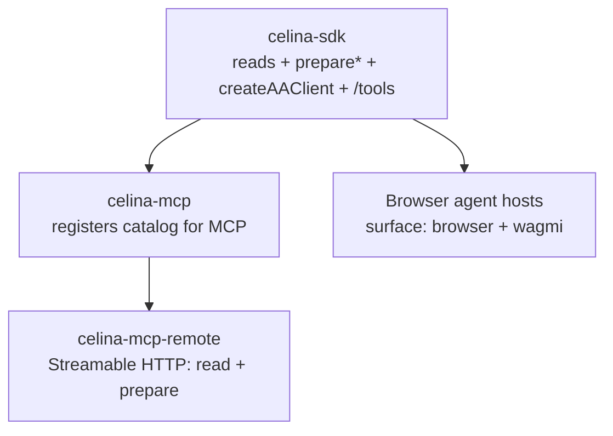

# Introduction

<div align="center"></div>

## Celina SDK

> **Server-side only.** This package includes server-native dependencies (`@agentkarma/sdk`, `@celo/attribution-tags`) that cannot be bundled for the browser. Import it only from Node.js environments — API routes, background workers (BullMQ / Vercel Cron), or CLI scripts.

Celina is a third-party, open-source stack that gives an LLM read, prepare, and execute access to Celo mainnet through an SDK, an MCP server, and a REST API. **`@andrewkimjoseph/celina-sdk`** is the SDK — a Celo mainnet library for agent builders: **reads**, **unsigned transaction preparation**, optional **ERC-4337 AA** via `createAAClient`, and a shared **LLM tool catalog** (`/tools` export) that powers celina-mcp and browser wallet apps from one source of truth.

Pair with [wagmi](https://wagmi.sh) / viem when users sign in their wallet, `createAAClient` for sponsored UserOps, or register the catalog in MCP / AI SDK hosts when building agents.

### Celina stack



| Layer                  | What it adds                                                                                                                                                               |
| ---------------------- | -------------------------------------------------------------------------------------------------------------------------------------------------------------------------- |
| **SDK** (this package) | Chain logic, `SerializedPreparedFlow` (`chainId: 42220`), ERC-8021 Celina attribution, `@andrewkimjoseph/celina-sdk/aa` (`createAAClient`), and `@andrewkimjoseph/celina-sdk/tools` |
| **MCP**                | Registers filtered catalog via `registerSdkTools`; stdio `execute_*` with `CELO_PRIVATE_KEY`; optional address defaults via [session wallet](guides/mcp-session-wallet.md) |
| **MCP remote**           | Public `https://mcp.usecelina.xyz/mcp` — hosted reads + prepare + attribution tools (no server-key writes; no sponsorship keys) |
| **Browser hosts**      | `filterToolDefinitions(..., { surface: "browser" })` — user signs prepared txs in wallet; no server keys                                                                   |

Third-party apps can consume the programmatic client only, or wire the full tool catalog into Vercel AI SDK / custom orchestrators — see [LLM tool catalog](guides/tool-catalog.md).

### What you can do

| Category                 | Examples                                                                                                             |
| ------------------------ | -------------------------------------------------------------------------------------------------------------------- |
| **Reads**                | Token balances, Mento FX quotes, Uniswap v4 quotes, governance, staking, ENS, GoodDollar whitelist/UBI, AgentKarma reputation |
| **Estimates**            | Gas for sends, FX swaps, Uniswap swaps, generic contract calls                                                       |
| **Prepare**              | Unsigned flows for sends, Mento FX, Uniswap v4, Aave, GoodDollar UBI claim, governance locks/votes, validator staking/delegation, generic contract writes (`chainId: 42220`) |
| **Humanness**            | `client.humanness.checkHumanness` — dual-rail Self Agent ID **or** GoodDollar whitelist check gating governance/staking prepares |
| **Sponsored UserOps**    | `createAAClient` + `sendPreparedFlow` (app-owned Pimlico key; optional `attributionTags`)                             |
| **Sign-time simulation** | `@andrewkimjoseph/celina-sdk/simulation` — `simulatePreparedStep` before each wallet send                            |
| **Attribution**          | Dual CELINA suffixes; prefer `check_attribution_tag` / `checkAttributionInCalldata` for unified custom tags          |
| **Tool catalog**         | `ALL_TOOL_DEFINITIONS`, `filterToolDefinitions` — same tools as celina-mcp, filterable by `surface` and `families`   |
| **Reputation**           | AgentKarma karma, ERC-8004 agent lookup, counterparty trust policy (read-only, external API)                         |

The SDK never holds CELO wallet keys on `createCelinaClient`. Call `prepare*` with the user's address, then pass `steps` to wagmi — or submit via `createAAClient` with your own gas sponsorship credentials.

Prepared / AA calldata uses **ERC-8021** Schema 0 attribution (`celina` + optional app codes). Optional `attributionTags` on `createCelinaClient` or `createAAClient` — see [On-chain attribution](guides/on-chain-attribution.md), [Configuration](getting-started/configuration.md), and [Account Abstraction](guides/account-abstraction.md). Historical txs may also carry legacy `CELINA|…` UTF-8; verify/check still decode it.

### Quick start

```ts
import { createCelinaClient } from "@andrewkimjoseph/celina-sdk";

const celina = createCelinaClient({
  rpcUrl: "https://forno.celo.org",
  ethRpcUrl: "https://ethereum.publicnode.com", // optional, for ENS
});

await celina.token.getStablecoinBalances("0xYourAddress");
await celina.mentoFx.getFxQuote("USDm", "EURm", "100");

const flow = await celina.transaction.prepareSend("0xFrom", "0xTo", "USDm", "10");
// flow.steps → wagmi sendTransactionAsync
```

For agent hosts, import the shared catalog:

```ts
import { filterToolDefinitions, ALL_TOOL_DEFINITIONS } from "@andrewkimjoseph/celina-sdk/tools";

const tools = filterToolDefinitions(ALL_TOOL_DEFINITIONS, {
  surface: "browser",
});
```

See [Quick start](getting-started/quick-start.md), [LLM tool catalog](guides/tool-catalog.md), [Prepared-step simulation](guides/prepared-step-simulation.md), and [wagmi integration](guides/wagmi-integration.md).

### API overview

| Service       | Reads                                            | Prepare (unsigned)                           |
| ------------- | ------------------------------------------------ | -------------------------------------------- |
| `blockchain`  | network status, blocks, transactions             | —                                            |
| `account`     | CELO balance, nonce                              | —                                            |
| `token`       | balances, token info, stablecoins                | —                                            |
| `ens`         | resolve ENS names                                | —                                            |
| `gooddollar`  | whitelist status, UBI entitlement, identity guidance | `prepareClaimUbi`                       |
| `transaction` | gas fees, estimates                              | `prepareSend`                                |
| `mentoFx`     | `getFxQuote`, `estimateFx`                       | `prepareFx`                                  |
| `uniswap`     | `getSwapQuote`, `estimateSwap`                   | `prepareSwap`                                |
| `aave`        | —                                                | `prepareSupply`, `prepareWithdraw`           |
| `governance`  | proposals, votable proposals, locked balance, pending withdrawals | `prepareLockCelo`, `prepareUnlockCelo`, `prepareRelockCelo`, `prepareWithdrawCelo`, `prepareVote` (humanness-gated) |
| `staking`     | balances, activatable stakes, validator groups, delegation info, `getStakeEligibility`, `getGovernanceDelegates` | `prepareStake`, `prepareActivateStake`, `prepareUnstake`, `prepareDelegatePower`, `prepareUndelegatePower` (humanness-gated) |
| `humanness`   | `checkHumanness` — dual-rail Self **or** GoodDollar        | —                                            |
| `nft`         | NFT info, balance                                | —                                            |
| `contract`    | `callFunction`, `estimateGas`                    | `prepareFunction`                            |
| `self`        | verify, lookup, session lifecycle                | agent signing (Node + `selfAgentPrivateKey`) |
| `agentKarma`  | karma, ERC-8004 agent, counterparty trust policy | —                                            |

Governance and staking `prepare*` writes require `checkHumanness` to pass first — see [Humanness](guides/humanness.md). Before staking, call `getStakeEligibility` (or rely on `prepareStake`'s built-in check) — see [Staking](guides/staking.md#stake-eligibility-pre-check). GoodDollar identity has two distinct paths (first-time face verify vs connecting a secondary wallet to an existing verified root) — see [GoodDollar UBI](guides/gooddollar.md#face-verify-vs-connect).

Full method signatures: [API reference](api-reference/).

### Related packages

* [`@andrewkimjoseph/celina-mcp`](https://www.usecelina.xyz/mcp/local) — MCP server; registers SDK tool catalog ([install guide](https://www.usecelina.xyz/mcp/local))
* [`celina-mcp-remote`](https://github.com/andrewkimjoseph/celina-mcp-remote) — hosted reads (`https://mcp.usecelina.xyz/mcp`); no server-key writes
* [`@selfxyz/agent-sdk`](https://www.npmjs.com/package/@selfxyz/agent-sdk)
