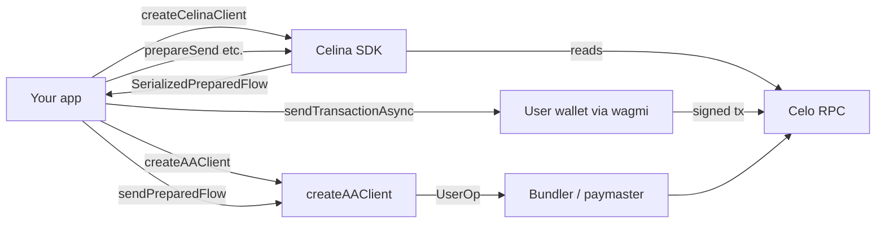
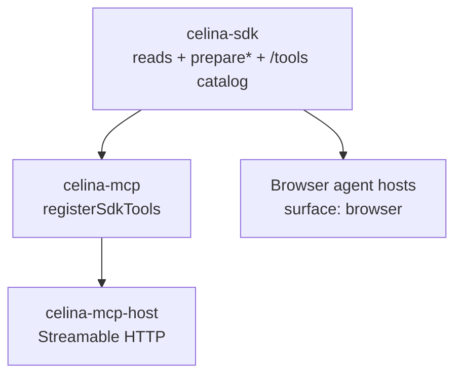

# Architecture

## Design principles

`createCelinaClient()` wires `CeloClientFactory` and `EnsClientFactory` into domain services. The SDK:

- Performs **public RPC reads** (balances, quotes, governance data)
- Builds **unsigned transaction payloads** for a caller-supplied `from` address
- **Does not hold CELO wallet keys** for `createCelinaClient` — pass prepared `steps` to wagmi/viem for EOA signing
- **`createAAClient`** (separate entry) submits prepared flows as sponsored ERC-4337 UserOps; gas sponsorship API keys are **app-owned** (see [Account Abstraction](../guides/account-abstraction.md))
- **Self Agent ID** (`client.self`) optionally uses `selfAgentPrivateKey` for agent signing tools (Node only); registration sessions are in-memory (~10 min TTL)
- **AgentKarma** (`client.agentKarma`) is a read-only external reputation adapter — calls agentkarma.io, not on-chain Celina reads; no keys, no Celina analytics
- **Telemetry** (Node only): catalog-mapped reads emit Amplitude events named after MCP tools; wallet-scoped reads also set Amplitude `user_id` to the public wallet address — see [Telemetry](../guides/telemetry.md); opt out with `analyticsEnabled: false`

Consumers pass prepared `steps` to wagmi/viem for wallet signing, or to `createAAClient().sendPreparedFlow` for sponsored UserOps.



## Celina stack

Celina is layered from chain logic through agent tooling:



| Layer | Role |
|-------|------|
| **SDK** (this package) | Chain logic, `SerializedPreparedFlow` (`chainId: 42220`), dual CELINA attribution, `createAAClient`, and `@andrewkimjoseph/celina-sdk/tools` |
| **MCP** | Registers filtered `ALL_TOOL_DEFINITIONS`; stdio `execute_*` with server keys |
| **MCP host** | Public `https://mcp.usecelina.xyz/api/mcp` — hosted reads + prepare + attribution tools (no server-key writes; no sponsorship keys) |
| **Browser hosts** | `filterToolDefinitions(..., { surface: "browser" })` — user signs in wallet; no server keys |

Third-party apps can use the programmatic client only, or wire the tool catalog into chat APIs — see [Tool catalog](../guides/tool-catalog.md).

### Sign-time guard

Browser hosts and local MCP simulate each prepared step immediately before broadcast via `@andrewkimjoseph/celina-sdk/simulation`. Wallet-specific logic (MiniPay fee currency, gas buffer UX) stays in the host app — not in the SDK.

### Wallet address: SDK vs MCP

| Consumer | Pattern |
|----------|---------|
| **SDK in a web app** | Pass `0xYourAddress` on every read/prepare (from wagmi, Privy, etc.) |
| **celina-mcp stdio + `CELO_PRIVATE_KEY`** | Omit `address` / `wallet_address` / `from` on wallet-scoped MCP tools; optional **`get_wallet_address`** when the agent needs the string |
| **Hosted MCP** | No server key — always pass explicit addresses |

See [MCP session wallet](../guides/mcp-session-wallet.md) for wallet param rules.

## Key utilities

| Export | Purpose |
|--------|---------|
| `@andrewkimjoseph/celina-sdk/tools` | Shared LLM tool catalog (`ToolDefinition`, `filterToolDefinitions`) — see [Tool catalog](../guides/tool-catalog.md) |
| `@andrewkimjoseph/celina-sdk/simulation` | `simulatePreparedStep` — dry-run each `PreparedTx` before broadcast |
| `appendCelinaCalldataTag` | Dual CELINA attribution (legacy + ERC-8021); tags from `createCelinaClient` or `createAAClient` |
| `createAAClient` / `deriveSmartAccountAddress` | Sponsored UserOps — see [Account Abstraction](../guides/account-abstraction.md) |
| `checkAttributionInCalldata` | Unified custom `tags` from calldata — see [On-chain attribution](../guides/on-chain-attribution.md) |

`createCelinaClient({ attributionTags })` flows into all `prepare*` services. `createAAClient({ attributionTags })` tags at `sendPreparedFlow` time. Prefer one consistent list per path.

These live in `src/utils/`, `src/aa/`, and `src/config/celina-tag.ts` and are re-exported from the package entry.

## Client composition

| Property | Service | Responsibility |
|----------|---------|----------------|
| `blockchain` | BlockchainService | Blocks, transactions, network status |
| `account` | AccountService | CELO balance, nonce |
| `token` | TokenService | Balances, token registry, stablecoin scans |
| `transaction` | TransactionService | Sends, gas fees |
| `mentoFx` | MentoFxService | Mento FX quotes and swaps |
| `uniswap` | UniswapService | Uniswap v4 quotes and swaps |
| `aave` | AaveService | Aave V3 supplied balance reads, supply/withdraw |
| `gooddollar` | GoodDollarService | Identity link, whitelist (connected-wallet root resolution), UBI entitlement, reserve quote/prepare (G$ ↔ USDm), `prepareClaimUbi` |
| `ens` | EnsService | ENS resolution (Celo + Ethereum) |
| `governance` | GovernanceService | Celo governance proposals |
| `staking` | StakingService | Validator election staking |
| `nft` | NftService | ERC-721 / ERC-1155 reads |
| `contract` | ContractService | Generic contract calls |
| `self` | SelfService | Self Agent ID verify, register, proof refresh (ai.self.xyz + on-chain registry) |
| `agentKarma` | AgentKarmaService | AgentKarma reputation reads and local trust policy (read-only, external API) |

## Source layout

| Path | Purpose |
|------|---------|
| `src/index.ts` | Public entry — `createCelinaClient()`, `createAAClient()`, and type exports |
| `src/aa/` | ERC-4337 AA client, gas sponsorship, prepared → UserOp mapping |
| `src/tools/` | LLM tool catalog — exported as `@andrewkimjoseph/celina-sdk/tools` |
| `src/clients/` | viem public clients (Celo + Ethereum for ENS) |
| `src/config/` | Token registry, Aave/GoodDollar/Uniswap constants, `celina-tag` |
| `src/services/` | Domain logic — reads and `prepare*` methods |
| `src/types/prepared.ts` | `SerializedPreparedFlow` contract (`chainId`) |
| `src/simulation/` | `simulatePreparedStep` for sign-time revert checks |
| `src/utils/` | Shared helpers — allowance simulation, token normalization |

## Adding a service

1. Create `src/services/my-feature.service.ts` accepting `CeloClientFactory` in the constructor.
2. Register the instance in `src/index.ts` on `CelinaClient`.
3. Export public types from `src/index.ts` if needed by consumers.
4. Run `npm run build`, `npm run docs:api`, and bump the package version before publishing.

## Publishing

```bash
npm version patch   # or minor/major
npm run docs:api
npm publish --access public
```
