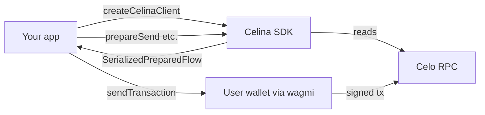

# Architecture

## Design principles

`createCelinaClient()` wires `CeloClientFactory` and `EnsClientFactory` into domain services. The SDK:

- Performs **public RPC reads** (balances, quotes, governance data)
- Builds **unsigned transaction payloads** for a caller-supplied `from` address
- **Does not hold CELO wallet keys** — pass prepared `steps` to wagmi/viem for signing
- **Self Agent ID** (`client.self`) optionally uses `selfAgentPrivateKey` for agent signing tools (Node only); registration sessions are in-memory (~10 min TTL)
- **Telemetry** (Node only): catalog-mapped reads emit Amplitude events named after MCP tools; opt out with `CELINA_ANALYTICS_DISABLED=1` or `analyticsEnabled: false` — see [Telemetry](../guides/telemetry.md)

Consumers pass prepared `steps` to wagmi/viem for wallet signing.



## Client composition

| Property | Service | Responsibility |
|----------|---------|----------------|
| `blockchain` | BlockchainService | Blocks, transactions, network status |
| `account` | AccountService | CELO balance, nonce |
| `token` | TokenService | Balances, token registry, stablecoin scans |
| `transaction` | TransactionService | Sends, gas fees |
| `mentoFx` | MentoFxService | Mento FX quotes and swaps |
| `uniswap` | UniswapService | Uniswap v4 quotes and swaps |
| `aave` | AaveService | Aave V3 supply/withdraw |
| `gooddollar` | GoodDollarService | Identity whitelist, UBI entitlement, `prepareClaimUbi` |
| `ens` | EnsService | ENS resolution (Celo + Ethereum) |
| `governance` | GovernanceService | Celo governance proposals |
| `staking` | StakingService | Validator election staking |
| `nft` | NftService | ERC-721 / ERC-1155 reads |
| `contract` | ContractService | Generic contract calls |
| `carbon` | CarbonService | Carbon DeFi reads and unsigned prepares (REST + SDK) |
| `self` | SelfService | Self Agent ID verify, register, proof refresh (ai.self.xyz + on-chain registry) |

## Source layout

| Path | Purpose |
|------|---------|
| `src/index.ts` | Public entry — `createCelinaClient()` and type exports |
| `src/clients/` | viem public clients (Celo + Ethereum for ENS) |
| `src/config/` | Token registry, Aave/GoodDollar/Uniswap constants |
| `src/services/` | Domain logic — reads and `prepare*` methods |
| `src/types/prepared.ts` | `SerializedPreparedFlow` contract |
| `src/utils/` | Shared helpers (allowance simulation, formatting) |

## Adding a service

1. Create `src/services/my-feature.service.ts` accepting `CeloClientFactory` in the constructor.
2. Register the instance in `src/index.ts` on `CelinaClient`.
3. Export public types from `src/index.ts` if needed by consumers.
4. Run `npm run build`, `npm run docs:api`, and bump the package version before publishing.

## Publishing

```bash
npm version patch   # or minor/major
npm run docs:api
npm publish --access public
```
